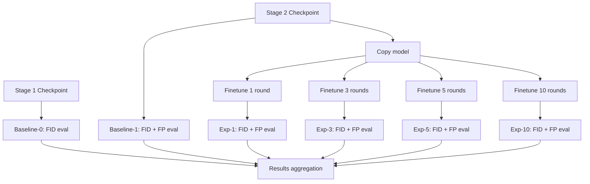

# Defingerprint Experiment Design

## Summary

This experiment validates the impact of removing fingerprints from federated learning diffusion models on generation quality (FID score) while measuring fingerprint retention rate.

**Core Hypothesis**: Fine-tuning on normal data can remove fingerprints while recovering near-baseline generation quality.

**Attack Method**: Fine-tuning attack (most realistic scenario where attacker doesn't know fingerprint embedding details)

## Experiment Groups

### Baselines

| Group | Model | Fingerprint Status | Purpose |
|-------|-------|-------------------|---------|
| Baseline-0 | Stage 1 model | No fingerprint | Optimal performance reference |
| Baseline-1 | Stage 2 model | With fingerprint | Verify fingerprint embedding impact |

### Finetuning Groups

| Group | Finetune Epochs | Purpose |
|-------|----------------|---------|
| Exp-1 | 1 round | Lightweight finetuning impact |
| Exp-3 | 3 rounds | Medium finetuning impact |
| Exp-5 | 5 rounds | Heavy finetuning impact |
| Exp-10 | 10 rounds | Extreme finetuning impact |

**Note**: Each group measures FID score + fingerprint retention rate.

## Technical Design

### Architecture

```
experiments/
└── defingerprint/
    ├── run_defingerprint.py          # Main experiment script
    ├── analyze_results.py            # Results analysis
    ├── visualize/
    │   └── plot_results.py           # Matplotlib visualization
    └── config/
        └── experiment_config.yaml    # Experiment configuration
```

### Core Parameters

| Parameter | Value | Reason |
|-----------|-------|--------|
| `finetune_lr` | 1e-4 | Same as training stage |
| `finetune_epochs` | [1, 3, 5, 10] | Comprehensive coverage |
| `finetune_data` | CIFAR-10 train set | Normal distribution (no trigger class) |
| `fid_samples` | 5000 | Standard evaluation size |
| `fingerprint_threshold` | 0.85 | FSS success threshold |

### Implementation Details

#### Fingerprint Generation

Since Stage 2 didn't save trace_data, need to regenerate:

```python
def generate_fingerprint_data(config):
    # Load model to get weight size
    model = load_model(config.baselines.stage2_checkpoint, config)
    weight_size = get_diffusion_embed_layers_length(model, config.fingerprint.embed_layer_names)
    
    # Generate fingerprints
    fingerprints = generate_fingerprints(config.fingerprint.num_clients, config.fingerprint.lfp_length)
    
    # Generate extracting matrices
    extract_matrices = generate_extracting_matrices(weight_size, config.fingerprint.lfp_length, config.fingerprint.num_clients)
    
    # Save for reuse
    # ...
    return fingerprints, extract_matrices
```

#### Finetuning Process

```python
def finetune_model(model, epochs, lr, train_data, device):
    """
    Finetune on normal data (no watermark data)
    
    Key: Use diffusion training loss on normal classes only
    """
    optimizer = torch.optim.Adam(model.parameters(), lr=lr)
    diffusion = SimpleDiffusion(num_timesteps=1000, device=device)
    
    for epoch in range(epochs):
        model.train()
        for batch in train_data:
            # Normal diffusion training, no watermark
            loss = diffusion.compute_loss(model, images, t)
            optimizer.step()
    
    return model
```

#### Evaluation Metrics

**FID Score**:
```python
# Normal class FID
results_normal = evaluate_fid(model, diffusion, test_dataset, args, device, num_samples=5000)
```

**Fingerprint Accuracy**:
```python
# Identify owner
best_idx, confidence, all_scores = identify_owner(
    model, fingerprints, extract_matrices, embed_layer_names, use_hamming=False
)

# Retention rate
fingerprint_retention = (confidence >= 0.85)
```

## Execution Flow



## Expected Results

| Group | FID Change | FP Retention | Notes |
|-------|------------|---------------|-------|
| Baseline-0 | Lowest (optimal) | 0% | No watermark/fingerprint reference |
| Baseline-1 | Slightly higher | ~100% | Fingerprint embedding reduces performance slightly |
| Exp-1 | Near Baseline-1 | 80-90% | Light finetuning, partial fingerprint retention |
| Exp-3 | Near Baseline-0 | 40-60% | Medium finetuning, massive fingerprint loss |
| Exp-5 | Near Baseline-0 | 10-30% | Heavy finetuning, almost no fingerprint |
| Exp-10 | May be lower | <10% | Over-finetuning, fingerprint gone and potential overfitting |

## Output Structure

```
result/defingerprint_experiments/
├── trace_data/
│   ├── fingerprints.npy
│   └── extract_matrices.npy
├── checkpoints/
│   ├── exp_1/model.pth
│   ├── exp_3/model.pth
│   ├── exp_5/model.pth
│   └── exp_10/model.pth
├── results.json
├── analysis_report.txt
└── defingerprint_results.png
```

## Visualization

Generate 3 Matplotlib plots:
1. **FID vs Finetune Epochs**: Line chart showing quality change
2. **Fingerprint Retention vs Finetune Epochs**: Line chart showing fingerprint disappearance speed
3. **Pareto Frontier**: FID (x-axis) vs Fingerprint Retention (y-axis)

## Timeline

| Phase | Time | Notes |
|-------|------|-------|
| Framework creation | 20 min | Write main script, config, helper functions |
| Run experiments | 2-4 hours | Depends on GPU and dataset size |
| Analysis | 10 min | Calculate statistical metrics |
| Visualization | 5 min | Generate Matplotlib plots |

## Assumptions

1. Stage 1 checkpoint available: `./result/simpleunet_cifar10_stage1/model_final.pth`
2. Stage 2 checkpoint available: `./result/simpleunet_cifar10_stage2/model_final.pth`
3. CIFAR-10 dataset accessible via `get_full_dataset()`
4. Single GPU environment (`--gpu 0`)

## Success Criteria

- ✅ Can reproduce FID scores for baselines
- ✅ Can measure fingerprint retention after finetuning
- ✅ Generate comparative visualization
- ✅ Identify Pareto optimal point (best quality with acceptable traceability trade-off)